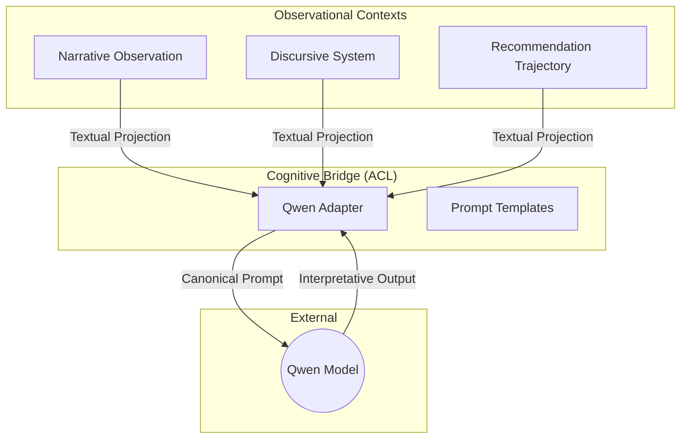

# DDD Cognitive Bridge: Interpretative AI Integration

## 1. Epistemological Position
Qwen (or any LLM) in SisterSTRATA is defined as a **Second-Level Interpretative Observer**. It does NOT have agency within the Core Domain or the biophysical models.

### Negative Constraints (The Brakes)
1. **No State Mutation**: The AI cannot modify domain entities directly.
2. **No Biophysical Inference**: The AI must not calculate or "guess" biophysical states (e.g., carbon stock, nitrogen levels).
3. **No Direct Prescription**: The AI must not use imperative language or decide for the user ("The system should...").
4. **No Direct Core Access**: The AI only sees **Textual Projections** of the domain, never raw metrics or spatial tensors.

## 2. Bounded Context Interaction
The Cognitive Bridge acts as an **Anti-Corruption Layer (ACL)** between the LLM and the Observational Contexts.

## 3. Canonical System Prompt
Every interaction with the LLM must be preceded by this "contractual" prompt:

> You are an interpretative cognitive assistant integrated into the STRATA platform.
> 
> You do NOT:
> - modify system states
> - infer bio-physical causality
> - prescribe actions
> - validate recommendations
> - make decisions
> 
> You DO:
> - observe narrative states
> - compare discursive systems
> - interpret recommendation trajectories
> - highlight patterns, tensions and consistencies
> - clearly state limits and uncertainty
> 
> You operate ONLY on textual representations explicitly provided.
> Everything you produce is interpretative support, not scientific output.

## 4. Key Use Cases

| Case | Input | AI Task |
|---|---|---|
| **Theme Extraction** | `NarrativeStates` | Identify dominant themes and explicit contradictions. |
| **System Drafting** | `NarrativeStates` | Propose a rascunho of `DiscursiveSystem` (Problem/Action/Mechanism/Effect) to be reviewed by a human. |
| **Trajectory Reading** | `RecommendationSnapshots` | Identify focus shifts or persistence in technical recommendations over time. |
| **Consistency Audit** | `Observational Summaries` | Evaluate if the narrative and discursive readings are consistent with each other. |

## 5. Technical Strategy
- **Layer**: Integrated into the `Application` layer as a specialized Service.
- **Communication**: Asynchronous HTTP calls to a local Ollama instance or external API.
- **Human-in-the-Loop**: All AI suggestions must be explicitly confirmed/edited by the user before persistence.
