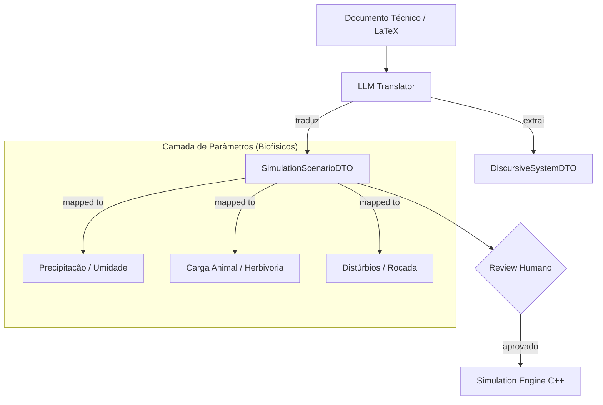

# CONTRATO: Ingestão de Cenários Paramétricos (Cognitive Bridge v2.1)

## 1. PROPÓSITO
Este contrato define a interface entre o **Conhecimento Discursivo** (recomendações técnicas) e o **Motor de Simulação** (Causalidade Biofísica), utilizando a LLM como um tradutor de baixa autoridade.

## 2. ARQUITETURA DE TRADUÇÃO (THE SEMANTIC BRIDGE)

A LLM não altera o estado do mundo. Ela produz um **SimulationScenarioDTO** que deve ser validado pelo usuário antes de alimentar o simulador.

## 3. O DTO DE CENÁRIO (SimulationScenarioDTO)

Este objeto contém a tradução quantitativa das recomendações qualitativas.

| Atributo | Significado Biofísico | Unidade / Range |
| :--- | :--- | :--- |
| `regrowth_multiplier` | Taxa de ganho de biomassa | Multiplicador (ex: 1.25) |
| `herbivory_intensity` | Intensidade de remoção (carga) | 0.0 a 1.0 |
| `soil_protection_factor` | Influência do dossel na infiltração | 0.0 a 1.0 |
| `duration_steps` | Tempo de aplicação da regra | Iterações ($dt$) |
| `spatial_target` | Máscara onde o cenário se aplica | Tipo de Solo / Relevo |

## 4. DIRETRIZES DE TRADUÇÃO (PROMPT ENGINEERING)

Para manter a integridade científica (Seção 7 do Manual Técnico), o tradutor LLM deve seguir estas regras:

1.  **Mapeamento Cauteloso**: Converta expressões como "carga moderada" para valores medianos de segurança (ex: 0.4).
2.  **Identificação de Janela de Resposta**: Identifique gatilhos (ex: "após a primeira chuva") e mapeie para condições de contorno no simulador.
3.  **Rastreabilidade**: Cada parâmetro gerado deve carregar o trecho do texto original que o justifica (ex: `herbivory_intensity: 0.4 # Justificativa: "manter carga moderada"`).

## 5. FLUXO DE EXECUÇÃO

1.  **Parser**: LLM lê o documento (ex: recomendação Embrapa).
2.  **Mapping**: LLM mapeia termos técnicos para atributos do `SimulationScenarioDTO`.
3.  **Staging**: O sistema exibe os parâmetros propostos na UI para ajuste fino.
4.  **Injector**: O usuário clica em "Simular Cenário" e os coeficientes são injetados nas equações do `VegetationSystem` e `HydrologySystem`.

---
*Status: Proposta Técnica v1.0*
*Data: 09 de Janeiro de 2026*
