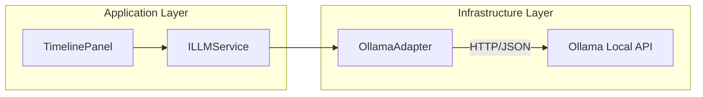

# manual Técnico: Integração Qwen & SisterSTRATA

Este documento detalha a implementação técnica da assistência cognitiva baseada em LLM (Large Language Model) no sistema SisterSTRATA.

## 1. Arquitetura de Integração (Hexagonal)

A integração segue o padrão **Ports & Adapters**, desacoplando a lógica científica da infraestrutura de IA.

### Componentes Principais:
- **`ILLMService` (Porta)**: Interface que define o contrato de comunicação assíncrona.
- **`OllamaAdapter` (Adaptador)**: Implementação concreta que gerencia a comunicação com a API REST do Ollama (localhost:11434).
- **`OllamaMockAdapter`**: Fallback para desenvolvimento offline ou sistemas sem Ollama instalado.

## 2. Fluxo de Execução Assíncrona

Para evitar travamentos na UI (freeze), o `OllamaAdapter` utiliza um modelo de **Worker Thread** com fila de requisições:

1. A UI solicita uma conclusão via `requestCompletion`.
2. A requisição é enfileirada (`std::queue`) e a thread principal é liberada imediatamente.
3. Uma thread de background (`workerThread_`) consome a fila:
    - Constrói o payload JSON.
    - Executa a chamada HTTP POST via `cpp-httplib`.
    - Realiza o parse da resposta via `nlohmann_json`.
4. Um callback é disparado com o resultado, que é então exibido na UI com proteção de `std::mutex`.

## 3. Descoberta Robusta de Modelos (Discovery Logic)

O sistema não possui o nome do modelo fixo (hardcoded), mas sim uma heurística de priorização baseada nas capacidades do host:

Ao iniciar o `isAvailable()`, o adaptador consulta o endpoint `/api/tags` e seleciona o modelo mais potente disponível seguindo esta prioridade:
1. `qwen2.5:72b`
2. `qwen2.5:32b`
3. `qwen2.5:14b`
4. `qwen2.5:7b`

Isso garante que se o usuário possuir uma máquina mais potente (ex: 14b), o SisterSTRATA a utilizará automaticamente sem necessidade de reconfiguração manual.

## 4. Engenharia de Contexto e Prompt

A "personalidade" e o rigor científico da IA são impostos via **System Prompt**.

- **Base de Contexto**: O arquivo `DDD_Cognitive_Assistance_Qwen_STRATA_v1.0.txt` é injetado integralmente como mensagem de sistema em cada nova interação.
- **Dados Científicos**: O prompt de usuário inclui explicitamente resultados quantitativos do STRATA (ex: `lastCoherenceMean`).
- **Isolamento**: O modelo nunca recebe pointers, grids reais ou código-fonte, apenas representações semânticas dos dados calculados.

## 5. Dependências Técnicas
- **cpp-httplib**: Header-only library para comunicação HTTP 1.1.
- **nlohmann_json**: Biblioteca para serialização/deserialização de payloads.
- **FetchContent (CMake)**: As dependências são baixadas e compiladas automaticamente durante o build, garantindo portabilidade.

## 6. Segurança e Performance
- **Timeout**: Configurado em 60s para acomodar o tempo de inferência em modelos maiores.
- **Fallback**: Se o Ollama não responder em `/api/tags` no startup, o sistema desativa as opções de IA na UI ou usa o Mock, prevenindo runtime errors.
- **Memory Safety**: O adaptador é injetado via `std::unique_ptr` no `Session`, garantindo limpeza correta no shutdown.

## 7. Integridade Epistemológica (Guarda-Rails)

Para garantir que a IA atue como uma ferramenta de apoio e não como uma fonte de autoridade indevida, a implementação segue diretrizes rigorosas:

- **Descrição vs. Prescrição**: O sistema é configurado para ser estritamente descritivo. O modelo deve relatar o que os dados sugerem, nunca prescrever ações de manejo ou políticas ambientais sem base determinística.
- **Isolamento de Causalidade**: A IA está proibida de inferir causalidade onde o STRATA fornece apenas correlação espacial ou temporal.
- **Transparência de Incerteza**: Respostas geradas devem conter ressalvas explícitas sobre a natureza interpretativa da análise.

## 8. Roadmap e Evolução (CAC v2)

Propostas para futuras iterações da integração cognitiva:

- **Níveis de Assertividade Gradual**: Implementação de um seletor de modo na UI:
    - *Modo Analítico*: Focado em fatos e fidelidade extrema aos dados.
    - *Modo Especulativo*: Permite a formulação de hipóteses ecológicas mais amplas (Hermenêutica Sugestiva).
- **Tokens de Cancelamento**: Melhoria na infraestrutura assíncrona para permitir o cancelamento imediato de inferências em andamento.
- **Contexto Multimodal**: Futura integração de metadados de relevo e hidrologia mais granulares no prompt.

---
*Versão 1.1 - Jan/2026 (Revisada com foco em integridade científica)*
