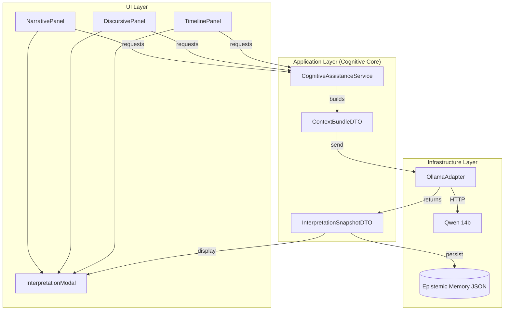

# Manual Técnico: Ponte Cognitiva STRATA (v2.0)

Este documento detalha a implementação da **Ponte Cognitiva** (Cognitive Bridge), uma arquitetura de integração entre o SisterSTRATA e modelos de linguagem de grande porte (LLMs), focada em rastreabilidade científica e integridade epistemológica.

## 1. Arquitetura de Integração (DDD + Hexagonal)

A v2.0 introduz uma camada de aplicação robusta que utiliza DTOs (Data Transfer Objects) para desacoplar totalmente o domínio da infraestrutura de IA.

### Componentes de Dados (Epistemic DTOs):
- **`ContextBundleDTO`**: O pacote semântico. Contém projeções textuais de narrativas, sistemas discursivos e trajetórias. É o único dado que a IA "enxerga".
- **`InterpretationSnapshotDTO`**: O artefato de memória. Contém a resposta da IA, o prompt utilizado, metadados de modelo e timestamp.

## 2. Robustez e Segurança de Threads (Thread-Safety)

Devido à natureza assíncrona do LLM e aos requisitos de rendering do ImGui (que não é thread-safe), a v2.0 implementa o mecanismo de **Deferred Popups**:

1. **Background Processing**: O `OllamaAdapter` executa a inferência em uma thread dedicada.
2. **Mutex Protection**: As variáveis de estado da IA (`lastAiSnapshot_`, `aiRequestPending_`) são protegidas por `std::mutex`.
3. **Signal & Defer**: O callback da IA **não** chama funções de UI diretamente. Ele seta uma flag `aiResultReady_`.
4. **Main Thread Sync**: No próximo ciclo de `draw()`, a thread principal detecta `aiResultReady_`, executa `ImGui::OpenPopup` e reseta a flag. 
   - *Resultado*: Estabilidade total e fim das Falhas de Segmentação durante o retorno da IA.

## 3. Seleção de Modelos e Inteligência Local

O sistema realiza uma descoberta dinâmica (Model Discovery) no startup:
- **Prioridade Estratégica**: `14b` -> `7b`.
- **Feedback**: O console log agora reporta exatamente qual modelo foi selecionado: `[Application] Ollama detected. Using qwen2.5:14b.`
- **Timeout**: Elevado para 120s para suportar inferências complexas de 14b em hardware diverso.

## 4. Memória Epistêmica (Interpretation Memory)

Diferente de versões anteriores onde a análise se perdia, a Ponte Cognitiva permite a persistência:
- **`interpretation_memory.json`**: Repositório central de todos os snapshots que o usuário escolheu "Salvar".
- **Traceability**: Cada snapshot guarda o ID do modelo e a data, permitindo auditoria futura das interpretações da IA.

## 4. Engenharia de Contexto e Prompt

A "personalidade" e o rigor científico da IA são impostos via **System Prompt**.

- **Base de Contexto**: O arquivo `DDD_Cognitive_Assistance_Qwen_STRATA_v1.0.txt` é injetado integralmente como mensagem de sistema em cada nova interação.
- **Dados Científicos**: O prompt de usuário inclui explicitamente resultados quantitativos do STRATA (ex: `lastCoherenceMean`).
- **Enriquecimento de Contexto (v1.8)**: Para análises de transição, o sistema agora calcula e injeta a distribuição de classes (Uso da Terra) de **ambos** os estados envolvidos, permitindo que a IA interprete a mudança estrutural real em vez de apenas o índice de estabilidade isolado.
- **Isolamento**: O modelo nunca recebe pointers, grids reais ou código-fonte, apenas representações semânticas dos dados calculados.

## 5. Dependências Técnicas
- **cpp-httplib**: Header-only library para comunicação HTTP 1.1.
- **nlohmann_json**: Biblioteca para serialização/deserialização de payloads.
- **FetchContent (CMake)**: As dependências são baixadas e compiladas automaticamente durante o build, garantindo portabilidade.

## 6. Segurança e Performance
- **Timeout**: Configurado em 120s para acomodar o tempo de inferência em modelos maiores (14b).
- **Fallback**: Se o Ollama não responder em `/api/tags` no startup, o sistema desativa as opções de IA na UI ou usa o Mock, prevenindo runtime errors.
- **Memory Safety**: O adaptador é injetado via `std::unique_ptr` no `Session`, garantindo limpeza correta no shutdown.

## 7. Integridade Epistemológica (Guarda-Rails)

Para garantir que a IA atue como uma ferramenta de apoio e não como uma fonte de autoridade indevida, a implementação segue diretrizes rigorosas:

- **Descrição vs. Prescrição**: O sistema é configurado para ser estritamente descritivo. O modelo deve relatar o que os dados sugerem, nunca prescrever ações de manejo ou políticas ambientais sem base determinística.
- **Isolamento de Causalidade**: A IA está proibida de inferir causalidade onde o STRATA fornece apenas correlação espacial ou temporal.
- **Transparência de Incerteza**: Respostas geradas devem conter ressalvas explícitas sobre a natureza interpretativa da análise.

## 8. Roadmap e Evolução (CAC v2)

Propostas para futuras iterações da integração cognitiva:

- **Níveis de Assertividade Gradual**: Implementação de um seletor de modo na UI:
    - *Modo Analítico*: Focado em fatos e fidelidade extrema aos dados.
    - *Modo Especulativo*: Permite a formulação de hipóteses ecológicas mais amplas (Hermenêutica Sugestiva).
- **Tokens de Cancelamento**: Melhoria na infraestrutura assíncrona para permitir o cancelamento imediato de inferências em andamento.
- **Contexto Multimodal**: Futura integração de metadados de relevo e hidrologia mais granulares no prompt.

## 9. Pipeline de Dados de Trajetória e Grounding Semântico (v1.8.2)

A análise multi-estado introduz um pipeline de extração de dados mais complexo para garantir que a IA tenha contexto espacial e temporal:

### 9.1. Extração de Métricas (Domain Layer)
- **`PatchAnalysisService`**: Varre o grid de cada `TimeSlice` capturado, calculando Área, Perímetro e Centroide.
- **`PatchPersistenceService`**: Garante que os dados de manchas históricas sejam persistidos de forma eficiente (LOD) para que a trajetória completa possa ser reconstruída rapidamente.

### 9.2. Abstração Semântica (Service Layer)
Para evitar o envio de tabelas numéricas cruas (o que consumiria muitos tokens e confundiria a interpretação), o **`PatchTrajectoryService`** realiza uma pré-análise:
- Converte tendências numéricas em categorias qualitativas ("ganho", "perda", "perda drástica").
- Calcula índices de estabilidade e volatilidade estrutural.
- Resume o contraste de adjacência (o que está ao redor da mancha).

### 9.3. Grounding de Hipóteses (UI Layer Integration)
Para que a IA fale a "língua do ecólogo", o sistema utiliza um **`nameResolver`** (lambda) injetado pelo `TimelinePanel`:
- O sistema intercepta IDs técnicos (ex: `13`) e consulta o `VegetationSystemOriginal`.
- Retorna o nome da Hipótese e o Tipo (ex: `FlorestalNatural`).
- O prompt final entregue ao LLM troca "Classe 13" por "Hypothesis_01 (FlorestalNatural)".

---

## Apêndice A: Dicionário de Dados Injetados (Data Dictionary)

Para garantir a transparência científica, abaixo estão listados todos os dados quantitativos reais extraídos do STRATA e injetados nos prompts:

### 1. Contexto de Transição (Hermenêutica Parcial)
| Variável | Descrição Técnica | Origem | Equação Base |
| :--- | :--- | :--- | :--- |
| `Metadata` | Timestamp e versão do estado capturado | `TimeSlice::getMetadata()` | - |
| `Composição %` | % de área ocupada por cada Hipótese | `TimelinePanel::getClassDistribution` | Histograma Linear |
| `SSI` | Índice de Similaridade Estrutural (0 a 1) | `CoherenceIntensityService` | $I_{coh}$ (Seção 4.4 Foundation) |

### 2. Contexto de Trajetória do Patch (Individual)
| Variável | Descrição Técnica | Origem | Equação Base |
| :--- | :--- | :--- | :--- |
| `Lifespan` | Numero de estados rastreados | `PatchTrajectory::getLifespan` | $n$ |
| `Net Area Trend` | Delta de área (Categorizado) | `PatchTrajectory::getNetAreaTrend` | $\Delta A$ (Seção 4.4 Foundation) |
| `Stability` | Média da constância da forma | `PatchTrajectory::getStructuralStabilityIndex` | $S$ (Seção 4.4 Foundation) |
| `Volatility` | Intensidade das mudanças de borda | `PatchTrajectory::getShapeVolatility` | $V$ (Seção 4.4 Foundation) |
| `Adjacency` | Classes vizinhas (%) | `PatchState::adjacencyByClass` | Matriz de Adjacência |

### 3. Contexto Global (Tático)
| Variável | Descrição Técnica | Origem | Equação Base |
| :--- | :--- | :--- | :--- |
| `Timeline Size` | Contagem total de estados | `Trajectory::getSlices` | - |
| `Composition Hist`| Matriz de composição (%) temporal | `getClassDistribution` | Série Temporal de Histogramas |

## 10. Pipeline de Contexto por Painel (Resumo v2.0)

| Painel | Modo de Interpretação | Fonte de Dados (ContextBundle) |
| :--- | :--- | :--- |
| **Narrative (NOC)** | `ThemeAnalysis` | Histórico de observações manuais. |
| **Discursive (DSC)** | `DiscursiveDraft` | Relação entre narrativas e sistemas de ação. |
| **Timeline (4D)** | `CoherenceCheck` | Índices SSI e distribuição de classes entre estados. |
| **Timeline (4D)** | `TrajectoryReading` | Resumo qualitativo da evolução de manchas e fragmentação. |

---
*Documentação v2.0 - Jan/2026*
*Consolidado por: Antigravity AI*
