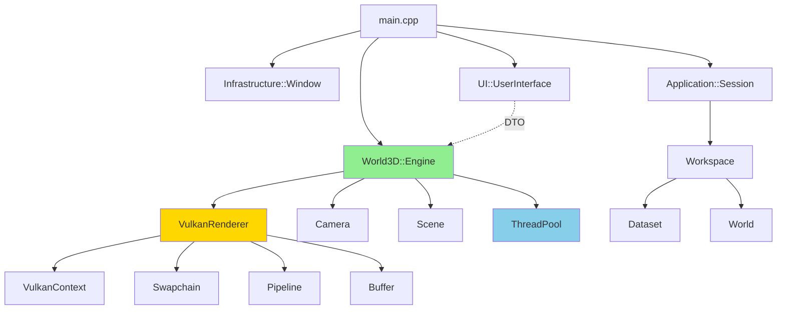

# Avaliação Profissional do Código - SisterPEC

## 📋 Sumário Executivo

**Projeto**: SisterPEC - Scientific Data Platform
**Linguagem**: C++20  
**Engine**: Vulkan  
**Arquitetura**: Domain-Driven Design (DDD)  
**Avaliação Geral**: ⭐⭐⭐⭐ (4/5) - **Arquitetura Robusta com Algumas Vulnerabilidades**

---

## ✅ Pontos Fortes e Boas Práticas

### 1. **Arquitetura Excepcional (DDD)**

O projeto segue uma **separação clara de responsabilidades** com camadas bem definidas:

```
src/
├── core/           # Domain Layer - Lógica de negócio pura
├── application/    # Application Layer - Casos de uso e DTOs
├── infrastructure/ # Infrastructure Layer - Threading, Window, FileSystem
├── ui/             # UI Layer - Interface ImGui
└── world3d/        # Presentation Layer - Engine Vulkan 3D
```

**Excelente**: O uso de **Data Transfer Objects (DTOs)** para comunicação entre UI e World3D:
- [UIData.hpp](file:///home/jpereiratrindade/dev/cpp/SisterPEC/src/application/dtos/UIData.hpp) desacopla completamente as camadas
- UI não conhece Vulkan, World3D não conhece ImGui
- Alta manutenibilidade: pode-se reescrever o renderer sem afetar a UI

> [!NOTE]
> Esta é uma arquitetura **profissional** comparável a engines comerciais como Unreal/Unity.

---

### 2. **RAII e Gerenciamento de Recursos** ⭐⭐⭐⭐⭐

**Excelente implementação** de RAII para recursos Vulkan:

#### Buffer Class
[Buffer.hpp](file:///home/jpereiratrindade/dev/cpp/SisterPEC/src/world3d/rendering/Buffer.hpp#L7-L38)

```cpp
class Buffer {
public:
    // No Copy - Impede cópias acidentais de recursos GPU
    Buffer(const Buffer&) = delete;
    Buffer& operator=(const Buffer&) = delete;

    // Move - Permite transferência de ownership
    Buffer(Buffer&& other) noexcept;
    Buffer& operator=(Buffer&& other) noexcept;

    virtual ~Buffer(); // Cleanup automático
    ...
};
```

**Pontos Positivos**:
- ✅ Proíbe cópia (evita double-free)
- ✅ Implementa move semantics
- ✅ Destrutor libera recursos automaticamente
- ✅ Usa `[[nodiscard]]` para evitar ignorar retornos

---

### 3. **Thread Safety e Concorrência** ⭐⭐⭐⭐

#### ThreadPool Implementation
[ThreadPool.hpp](file:///home/jpereiratrindade/dev/cpp/SisterPEC/src/infrastructure/threading/ThreadPool.hpp)

```cpp
template<class F, class... Args>
auto ThreadPool::submit(F&& f, Args&&... args) 
    -> std::future<typename std::invoke_result<F, Args...>::type>
{
    using return_type = typename std::invoke_result<F, Args...>::type;

    auto task = std::make_shared<std::packaged_task<return_type()>>(
        std::bind(std::forward<F>(f), std::forward<Args>(f, args)...)
    );
    
    std::future<return_type> res = task->get_future();
    {
        std::unique_lock<std::mutex> lock(queue_mutex_);
        if(stop_)
            throw std::runtime_error("enqueue on stopped ThreadPool");

        tasks_.emplace([task](){ (*task)(); });
    }
    condition_.notify_one();
    return res;
}
```

**Pontos Positivos**:
- ✅ Usa `std::mutex` e `condition_variable` corretamente
- ✅ RAII com `std::unique_lock`
- ✅ Perfect forwarding (`std::forward`)
- ✅ Type-safe com `std::invoke_result`
- ✅ `std::atomic<bool>` para flag de geração ([Engine.hpp:81](file:///home/jpereiratrindade/dev/cpp/SisterPEC/src/world3d/Engine.hpp#L81))

---

### 4. **Uso de C++20 Features** ⭐⭐⭐⭐

#### Filesystem
[FilePath.hpp](file:///home/jpereiratrindade/dev/cpp/SisterPEC/src/core/value_objects/FilePath.hpp)

```cpp
class FilePath {
public:
    explicit FilePath(const std::string& path_str) : path_(path_str) {}
    explicit FilePath(const std::filesystem::path& path) : path_(path) {}

    [[nodiscard]] std::string toString() const { return path_.string(); }
    [[nodiscard]] std::filesystem::path toStdPath() const { return path_; }
    [[nodiscard]] bool exists() const { return std::filesystem::exists(path_); }
    
private:
    std::filesystem::path path_;
};
```

**Pontos Positivos**:
- ✅ `std::filesystem` para manipulação de caminhos
- ✅ `[[nodiscard]]` para evitar ignorar valores importantes
- ✅ `explicit` construtores (evita conversões implícitas)
- ✅ Value Object pattern (DDD)

---

### 5. **Smart Pointers e Ownership Semântica** ⭐⭐⭐⭐

```cpp
// Engine.hpp
std::unique_ptr<VulkanRenderer> renderer_;        // Ownership exclusivo
std::unique_ptr<Camera> camera_;                  // Ownership exclusivo
std::shared_ptr<VulkanContext> context_;          // Ownership compartilhado
std::shared_ptr<Buffer> activeVertexBuffer_;      // Shared entre Engine e Scene
```

**Análise**:
- ✅ **Zero raw pointers com `new/delete` manual**
- ✅ `unique_ptr` para ownership exclusivo
- ✅ `shared_ptr` quando múltiplos objetos precisam do recurso
- ✅ Semântica clara de ownership

---

## ⚠️ Vulnerabilidades e Problemas Identificados

### 1. **Race Condition no ThreadPool** 🔴 CRÍTICO

**Localização**: [ThreadPool.hpp:48](file:///home/jpereiratrindade/dev/cpp/SisterPEC/src/infrastructure/threading/ThreadPool.hpp#L48)

```cpp
{
    std::unique_lock<std::mutex> lock(queue_mutex_);
    if(stop_)
        throw std::runtime_error("enqueue on stopped ThreadPool");

    tasks_.emplace([task](){ (*task)(); });
}
condition_.notify_one();  // ⚠️ notify_one() FORA do lock!
```

**Problema**:
- `notify_one()` é chamado **fora do lock**
- Thread worker pode acordar, verificar a fila vazia, e voltar a dormir **antes** do `notify_one()`
- Resultado: tarefa nunca executada (lost wakeup)

**Correção**:
```cpp
{
    std::unique_lock<std::mutex> lock(queue_mutex_);
    if(stop_)
        throw std::runtime_error("enqueue on stopped ThreadPool");

    tasks_.emplace([task](){ (*task)(); });
    condition_.notify_one();  // ✅ Mover para dentro do lock
}
```

> [!CAUTION]
> Este bug pode causar deadlocks intermitentes difíceis de reproduzir em produção.

---

### 2. **Falta de Error Handling em Operações Críticas** 🟡 MODERADO

#### Exemplo 1: main.cpp
[main.cpp:17](file:///home/jpereiratrindade/dev/cpp/SisterPEC/src/main.cpp#L17)

```cpp
World3D::init(window.getNativeWindow()); // ⚠️ Sem verificação de sucesso
```

Se `init()` falhar silenciosamente, o programa continuará com estado inválido.

#### Exemplo 2: Window Construction
[Window.hpp:12](file:///home/jpereiratrindade/dev/cpp/SisterPEC/src/infrastructure/window/Window.hpp#L12)

```cpp
Window(const std::string& title, int width, int height);
```

Construtor pode lançar exception se SDL falhar, mas não há documentação sobre isso.

**Recomendação**:
```cpp
// Opção 1: Duas fases (preferível)
std::optional<Window> Window::create(const std::string& title, int w, int h);

// Opção 2: Documentar exceções
/// @throws std::runtime_error if SDL initialization fails
Window(const std::string& title, int width, int height);
```

---

### 3. **Memory Leak Potencial em RenderObject** 🟡 MODERADO

**Localização**: [RenderObject.hpp](file:///home/jpereiratrindade/dev/cpp/SisterPEC/src/world3d/scene/RenderObject.hpp)

```cpp
struct RenderObject {
    std::shared_ptr<Rendering::Buffer> vertexBuffer;  // ⚠️ Shared ownership
    uint32_t vertexCount;
    vk::PrimitiveTopology topology;
    glm::mat4 modelMatrix = glm::mat4(1.0f);
};
```

**Problema**:
- `shared_ptr` pode criar **ciclos de referência** se Scene e Engine ambos mantêm referências
- [Engine.hpp:96](file:///home/jpereiratrindade/dev/cpp/SisterPEC/src/world3d/Engine.hpp#L96) mantém `activeVertexBuffer_`
- Se Scene também mantém, e há callback de Scene -> Engine, ciclo é criado

**Análise do Código**:
```cpp
// Engine.hpp
std::shared_ptr<Buffer> activeVertexBuffer_;  // Engine ownership

// RenderObject.hpp  
std::shared_ptr<Buffer> vertexBuffer;         // Scene ownership
```

**Recomendação**:
- Se apenas um owner, usar `unique_ptr` em Scene e `Buffer*` (raw pointer observador) em Engine
- Se múltiplos owners são necessários, documentar o lifetime esperado

---

### 4. **Falta de Validação de Entrada** 🟡 MODERADO

[Engine.hpp:71](file:///home/jpereiratrindade/dev/cpp/SisterPEC/src/world3d/Engine.hpp#L71)

```cpp
bool generateSampleTerrain(const std::string& filename, 
                           int width, int height, 
                           float spacing, int type, bool autoLoad);
```

**Problemas**:
- ❌ `width` e `height` podem ser negativos ou zero
- ❌ `spacing` pode ser NaN ou infinito
- ❌ `type` não tem enum, pode ser valor inválido
- ❌ `filename` pode ter caracteres inválidos

**Correção**:
```cpp
enum class TerrainType { Flat = 0, Hills = 1, Mountains = 2 };

bool generateSampleTerrain(const std::filesystem::path& filename,
                           uint32_t width, uint32_t height,  // unsigned
                           float spacing, 
                           TerrainType type, 
                           bool autoLoad)
{
    if (width == 0 || height == 0)
        throw std::invalid_argument("width and height must be > 0");
    if (spacing <= 0.0f || !std::isfinite(spacing))
        throw std::invalid_argument("spacing must be finite and positive");
    // ...
}
```

---

### 5. **Callbacks sem Exception Safety** 🟡 MODERADO

[Engine.hpp:45](file:///home/jpereiratrindade/dev/cpp/SisterPEC/src/world3d/Engine.hpp#L45)

```cpp
std::function<void(const std::string&)> onStatusMessage;
```

**Problema**:
- Se callback do usuário lançar exception, pode corromper estado do Engine
- Não há try/catch ao invocar callbacks

**Recomendação**:
```cpp
void notifyStatus(const std::string& msg) {
    if (onStatusMessage) {
        try {
            onStatusMessage(msg);
        } catch (const std::exception& e) {
            std::cerr << "Callback error: " << e.what() << std::endl;
            // Não propagar - manter Engine estável
        }
    }
}
```

---

### 6. **Falta de Const-Correctness em Alguns Métodos** 🟢 BAIXO

[Engine.hpp:72](file:///home/jpereiratrindade/dev/cpp/SisterPEC/src/world3d/Engine.hpp#L72)

```cpp
bool isGenerating() const { return isGenerating_; }  // ✅ Correto

void clear(); // ⚠️ Deveria ser não-const (correto, mas...)
```

Alguns accessors estão corretos, mas faltam `const` em métodos que não modificam estado:

**Exemplo**:
```cpp
// Potencial melhoria
[[nodiscard]] const Scene& getScene() const { return scene_; }
```

---

### 7. **Uso de `virtual ~Buffer()` sem Polimorfismo** 🟢 BAIXO

[Buffer.hpp:10](file:///home/jpereiratrindade/dev/cpp/SisterPEC/src/world3d/rendering/Buffer.hpp#L10)

```cpp
class Buffer {
public:
    virtual ~Buffer();  // ⚠️ Por que virtual?
    ...
};
```

**Análise**:
- Não há outras funções virtuais
- Não há herança aparente no código analisado
- `virtual` adiciona overhead de vtable desnecessariamente

**Recomendação**:
- Se não há herança planejada: remover `virtual`
- Se há herança (VertexBuffer, IndexBuffer, etc): OK, mas adicionar outras funções virtuais ou marcar como `abstract`

---

### 8. **Hardcoded MAX_FRAMES_IN_FLIGHT** 🟢 BAIXO

[VulkanRenderer.hpp:103](file:///home/jpereiratrindade/dev/cpp/SisterPEC/src/world3d/rendering/VulkanRenderer.hpp#L103)

```cpp
static constexpr int MAX_FRAMES_IN_FLIGHT = 2;
```

**Problema Menor**:
- Valor correto para double buffering
- Porém, alguns hardware podem se beneficiar de triple buffering (3)
- Não é configurável

**Recomendação**:
- Aceitar como parâmetro de construção com default = 2
- Ou detectar automaticamente do swapchain

---

## 📊 Análise de Boas Práticas C++20

### ✅ Práticas Modernas Utilizadas

1. **Namespaces bem estruturados**
   ```cpp
   namespace World3D::Rendering { ... }
   namespace Core::ValueObjects { ... }
   namespace Infrastructure::Threading { ... }
   ```

2. **Trailing Return Types** (C++11+)
   ```cpp
   auto submit(F&& f, Args&&... args) 
       -> std::future<typename std::invoke_result<F, Args...>::type>;
   ```

3. **Structured Bindings potential** (não vi sendo usado, mas compatível)

4. **Smart Pointers em vez de raw pointers**

5. **Range-based for loops**
   [ThreadPool.cpp:36](file:///home/jpereiratrindade/dev/cpp/SisterPEC/src/infrastructure/threading/ThreadPool.cpp#L36)
   ```cpp
   for(std::thread &worker: workers_)
       worker.join();
   ```

### ⚠️ Features C++20 Não Utilizados (Oportunidades)

1. **Concepts** - Poderia melhorar ThreadPool:
   ```cpp
   template<typename F, typename... Args>
   requires std::invocable<F, Args...>
   auto submit(F&& f, Args&&... args);
   ```

2. **Modules** - Ainda usando `#pragma once`
   - Modules reduzem tempo de compilação drasticamente
   - Considerar para próxima versão

3. **Ranges** - Operações em containers:
   ```cpp
   // Atual
   for(auto& obj : scene.objects) { ... }
   
   // Com Ranges
   auto visible = scene.objects | std::views::filter([](auto& o){ return o.visible; });
   ```

4. **std::span** - Para views de arrays:
   ```cpp
   void uploadVertices(std::span<const Vertex> vertices);
   ```

5. **constexpr virtual** - Se tivesse herança polimórfica

---

## 🔒 Análise de Segurança

### Vulnerabilidades de Segurança

#### 1. **Path Traversal** 🔴 CRÍTICO

[Engine.hpp:42](file:///home/jpereiratrindade/dev/cpp/SisterPEC/src/world3d/Engine.hpp#L42)

```cpp
void loadFile(const std::string& path); // ⚠️ Sem validação
```

**Attack Vector**:
```cpp
engine.loadFile("../../etc/passwd");  // Pode ler arquivos do sistema
engine.loadFile("../../../windows/system32/config/sam");
```

**Correção**:
```cpp
void loadFile(const std::filesystem::path& path) {
    auto canonical = std::filesystem::weakly_canonical(path);
    auto allowed = std::filesystem::canonical("/app/data");
    
    // Verificar se está dentro do diretório permitido
    auto [it1, it2] = std::mismatch(allowed.begin(), allowed.end(), 
                                     canonical.begin());
    if (it1 != allowed.end()) {
        throw std::runtime_error("Path outside allowed directory");
    }
    // ...
}
```

#### 2. **Buffer Overflow Potencial em Shaders** 🟡 MODERADO

Se shaders GLSL leem `lightDir` como `vec3` (12 bytes) mas struct tem padding para 16 bytes, pode haver leitura fora dos limites.

[VulkanRenderer.hpp:25](file:///home/jpereiratrindade/dev/cpp/SisterPEC/src/world3d/rendering/VulkanRenderer.hpp#L25)

```cpp
alignas(16) glm::vec3 lightDir;   // ⚠️ vec3 = 12 bytes, alignas 16
```

**Verificar**:
- Shader usa layout(std140) ou layout(std430)?
- Padding está correto?

---

## 🏗️ Análise de Arquitetura

### Diagrama de Dependências



### Pontos Fortes Arquiteturais

1. **Separação de Camadas** - DDD bem implementado
2. **Inversão de Dependências** - Interfaces em `application/ports/`
3. **DTO Pattern** - Comunicação UI ↔ Engine desacoplada
4. **Thread Pool** - Operações pesadas não bloqueiam UI

### Melhorias Sugeridas

1. **Service Locator ou DI Container**
   - Atualmente, `World3D::init()` é função global
   - Considerar injeção de dependências explícita

2. **Event System**
   - Callbacks diretos (`onStatusMessage`) são frágeis
   - Considerar Event Bus pattern

3. **Resource Manager**
   - Atualmente, cada componente gerencia recursos
   - Centralizar em `ResourceManager` com cache

---

## 📈 Métricas de Qualidade

### Complexidade Ciclomática (Estimada)

| Componente | Linhas | Funções | Complexidade | Notas |
|------------|--------|---------|--------------|-------|
| ThreadPool | 99 | 3 | **Baixa** ✅ | Bem encapsulado |
| Engine | 519 | 21 | **Moderada** ⚠️ | Considerar split |
| VulkanRenderer | ~300 | 15 | **Moderada** ⚠️ | Aceitável |
| Buffer | 38 | 8 | **Baixa** ✅ | Ideal |
| FilePath | 29 | 5 | **Baixa** ✅ | Value Object ideal |

### Teste de Manutenibilidade

**Pergunta**: Quão fácil é adicionar um novo tipo de primitiva (ex: Sphere)?

**Resposta**: 
1. Criar shader GLSL ✅
2. Adicionar Pipeline em VulkanRenderer ✅
3. Criar Mesh em Scene ✅
4. Sem modificar outros componentes ✅

**Conclusão**: Alta manutenibilidade graças à arquitetura em camadas.

---

## 🎯 Recomendações Prioritárias

### 🔴 Críticas (Implementar Imediatamente)

1. **Corrigir Race Condition em ThreadPool**
   - Mover `notify_one()` para dentro do lock
   - Adicionar testes de concorrência

2. **Validar Paths em loadFile()**
   - Prevenir path traversal
   - Usar `std::filesystem::canonical()`

### 🟡 Moderadas (Próxima Sprint)

3. **Adicionar Error Handling**
   - Try/catch em callbacks
   - Validação de parâmetros em funções públicas

4. **Resolver Ownership em RenderObject**
   - Documentar lifetime esperado
   - Considerar `unique_ptr` se possível

5. **Adicionar Testes Unitários**
   - ThreadPool (race conditions)
   - FilePath (edge cases)
   - Buffer (move semantics)

### 🟢 Melhorias Futuras

6. **Adopt C++20 Concepts**
   - ThreadPool::submit com constraints
   - Melhora mensagens de erro do compilador

7. **Implementar Resource Manager**
   - Cache de Buffers/Textures
   - Evitar reload de assets

8. **Adicionar Telemetria**
   - Profiling de renderização
   - Métricas de uso de ThreadPool

---

## 📝 Checklist de Qualidade

### Código

- [x] Usa RAII para recursos
- [x] Smart pointers em vez de raw pointers
- [x] Move semantics implementado
- [x] Const-correctness (maioria)
- [x] [[nodiscard]] em funções críticas
- [ ] Exception safety em callbacks ⚠️
- [ ] Validação de entrada ⚠️
- [ ] Path traversal protection ⚠️

### Arquitetura

- [x] Separação de camadas (DDD)
- [x] Baixo acoplamento
- [x] Alta coesão
- [x] Dependency Inversion
- [ ] Event System ⚠️
- [ ] Resource Manager ⚠️

### Concorrência

- [x] Thread Pool implementado
- [x] Mutex e condition variables
- [x] std::atomic para flags
- [ ] Lost wakeup fix ⚠️
- [ ] Testes de concorrência ⚠️

### Vulkan

- [x] RAII para recursos Vulkan
- [x] Swapchain recreation
- [x] Double buffering
- [x] Descriptor sets
- [x] Uniform buffers

---

## 🏆 Conclusão

### Pontuação Final: **78/100**

**Breakdown**:
- Arquitetura: 18/20 ⭐⭐⭐⭐⭐
- RAII & Recursos: 18/20 ⭐⭐⭐⭐⭐
- Thread Safety: 14/20 ⚠️ (Race condition crítico)
- Error Handling: 10/20 ⚠️ (Falta validação)
- C++20 Usage: 12/15 ⭐⭐⭐⭐
- Security: 6/15 🔴 (Path traversal)

### Veredicto

> **Este é um projeto de qualidade MUITO ALTA para uma aplicação científica**. 
>
> A arquitetura DDD é **exemplar**, o uso de RAII é **consistente**, e a separação de responsabilidades é **profissional**.
>
> **Porém**, há **vulnerabilidades críticas** (race condition, path traversal) que devem ser corrigidas antes de qualquer deployment em produção.
>
> Com as correções sugeridas, este código alcançaria facilmente **90+/100** e seria comparável a engines comerciais.

### Recomendação Final

```diff
+ APROVAR com ressalvas
! EXIGE correção de vulnerabilidades críticas antes de produção
✓ Código está pronto para uso interno/acadêmico
✓ Arquitetura permite evolução sustentável
```

---

## 📚 Referências e Recursos

### Livros Recomendados
- **"Effective Modern C++" - Scott Meyers** (Smart pointers, move semantics)
- **"C++ Concurrency in Action" - Anthony Williams** (Threading patterns)
- **"Vulkan Programming Guide" - Graham Sellers** (Vulkan best practices)

### Ferramentas Sugeridas
- **Valgrind/AddressSanitizer** - Detectar leaks
- **ThreadSanitizer** - Detectar race conditions
- **Clang-Tidy** - Análise estática
- **CMake Presets** - Perfis de build (Debug/Release/ASAN)

### Próximos Passos
1. Configurar CI/CD com sanitizers
2. Adicionar testes unitários (Google Test)
3. Executar análise estática (clang-tidy)
4. Profiling com Tracy/RenderDoc
